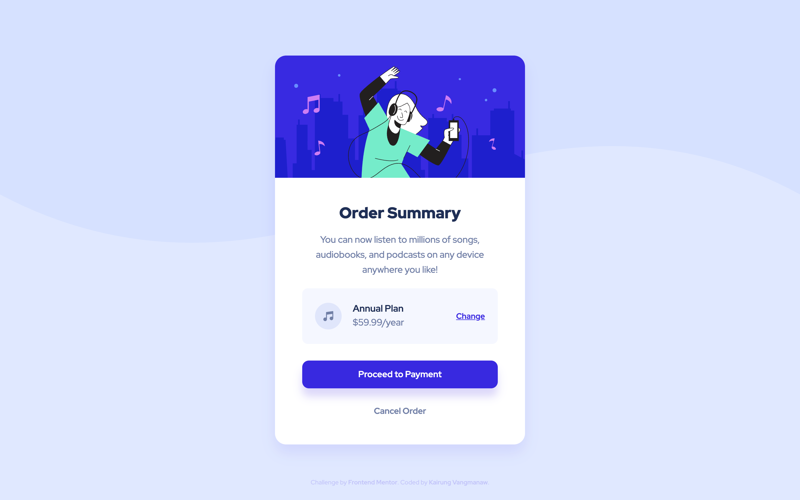
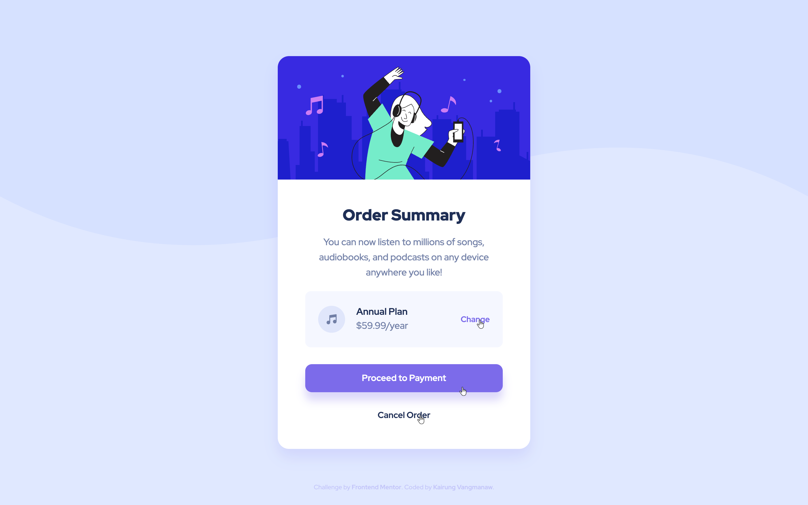

# Frontend Mentor - Order summary card solution


This is a solution to the [Order summary card challenge on Frontend Mentor](https://www.frontendmentor.io/challenges/order-summary-component-QlPmajDUj). Frontend Mentor challenges help you improve your coding skills by building realistic projects.

## Table of contents

- [Frontend Mentor - Order summary card solution](#frontend-mentor---order-summary-card-solution)
  - [Table of contents](#table-of-contents)
  - [Overview](#overview)
    - [The challenge](#the-challenge)
    - [Screenshot](#screenshot)
    - [Links](#links)
  - [My process](#my-process)
    - [Built with](#built-with)
    - [What I learned](#what-i-learned)
    - [Continued development](#continued-development)
    - [Useful resources](#useful-resources)
    - [AI Collaboration](#ai-collaboration)
  - [Author](#author)
  - [Acknowledgments](#acknowledgments)

## Overview

### The challenge

Users should be able to:

- See hover states for interactive elements

### Screenshot

<details>
  <summary>Mobile view</summary>
  
</details>

<details>
  <summary>Desktop view</summary>
  
</details>

<details>
  <summary>Active state view</summary>
  
</details>

### Links

- Solution URL: [Order Summary Card Component built with React, Vite, and Modern CSS](https://www.frontendmentor.io/solutions/test-sZaqCmRtft)
- Live Site URL: [Frontend Mentor | Order summary card](https://challenged-by-frontend-mentor.github.io/order-summary-component/)

## My process

### Built with

- Semantic HTML5 markup
- CSS Custom Properties (Variables)
- Flexbox & CSS Grid Layout
- Mobile-first workflow
- BEM (Block Element Modifier) Naming Convention
- Fluid Typography with clamp()
- [React](https://react.dev/) - JS Library
- [Vite](https://vite.dev/) - Frontend Tooling

### What I learned

Working on this component helped me refine my CSS architecture and environment setup. A major technical takeaway was understanding how to use `flex-grow` effectively to create fluid layouts without resorting to negative margins or complex position calculations.

```css
/* Flexible container using flex-grow to push action buttons neatly */
.plan__detail {
  display: flex;
  flex-direction: column;
  text-align: left;
  gap: 3px;
  flex-grow: 1; /* Naturally expands to take available space */
}
```

I also gained valuable debugging experience during deployment. After pushing the build, I encountered a blank screen. I traced the issue back to missing the `base` relative path configuration in `vite.config.js`. It was a great lesson that reinforced the importance of double-checking build environment configurations early on to save debugging time later.

### Continued development

For future iterations and upcoming projects, I want to explore several improvements:

- **Animated Banners & Micro-interactions:** Replacing static banner images with subtle CSS/SVG animations or micro-interactions to make the card visually engaging and dynamic.
- **Vibrant Visual Themes:** Experimenting with richer color palettes and custom dark/light themes, as the current design palette feels a bit mute and could benefit from stronger contrast to catch the user's eye.
- **Multi-plan Comparison & Selection:** Extending the layout into a multi-option plan selector, making it easier for users to compare tiers (e.g., Monthly vs. Annual) side-by-side within a single flow.
- **State Management & Interactivity:** Adding interactive modals or dropdown state toggles for changing order details dynamically.

### Useful resources

- [**HTML metadata element - MDN**](https://developer.mozilla.org/en-US/docs/Web/HTML/Reference/Elements/meta) - Referenced from previous project feedback to properly configure responsive viewports and modern HTML metadata.
- [**flex-grow CSS property - MDN**](https://developer.mozilla.org/en-US/docs/Web/CSS/Reference/Properties/flex-grow) - Helped me understand how flex items distribute remaining space dynamically inside parent containers.

### AI Collaboration

I leveraged AI tools to streamline my development and refactoring process:

- **Tools Used**: Google Gemini and Google Search AI Mode.
- **How It Helped**: Gemini provided key architectural suggestions on CSS structure, specifically introducing the concept of using flex-grow: 1 instead of negative margins to handle spatial alignment cleanly.
- **Takeaway**: Using AI as a code reviewer helped me spot subtle CSS maintenance pitfalls early and evaluate modern layout alternatives efficiently.

## Author

- GitHub: [Kirung Vangmanaw](https://github.com/VangmanawKairung)
- Frontend Mentor - [@VangmanawKairung](https://www.frontendmentor.io/profile/VangmanawKairung)

## Acknowledgments

- **Myself:** For staying resilient, continuous learning, and never giving up along the way.
- **My Family:** For unconditionally supporting all my goals and aspirations.
- **Tools & Software:** Huge thanks to VS Code and its awesome extensions, as well as macOS for built-in utilities like Preview, which made measuring precise element dimensions in pixels effortless.
- **Google:** For providing free and powerful AI tools like Gemini to assist in learning and development.
